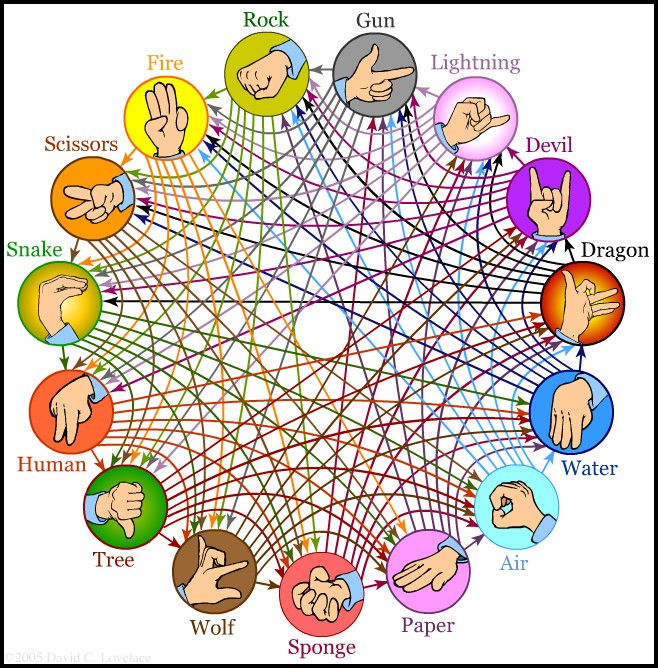
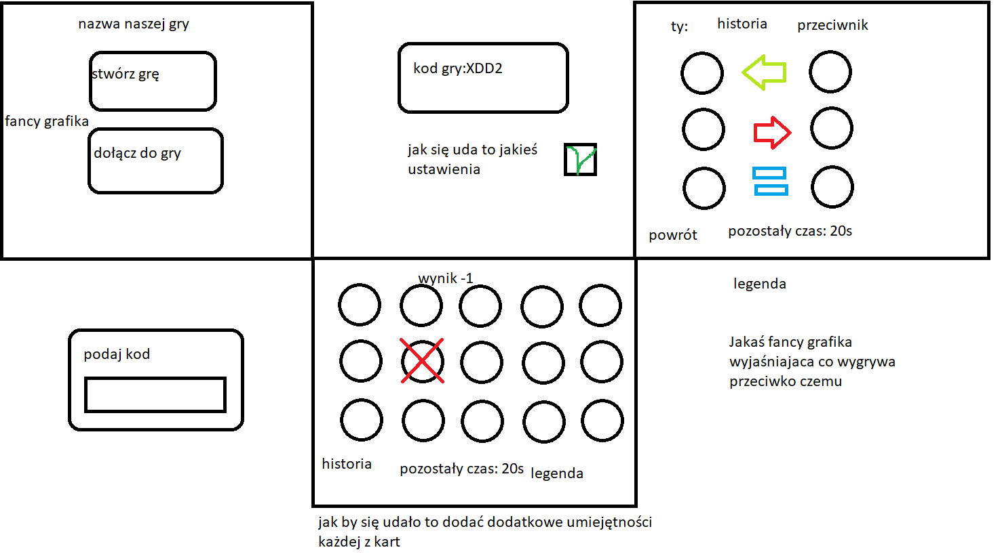
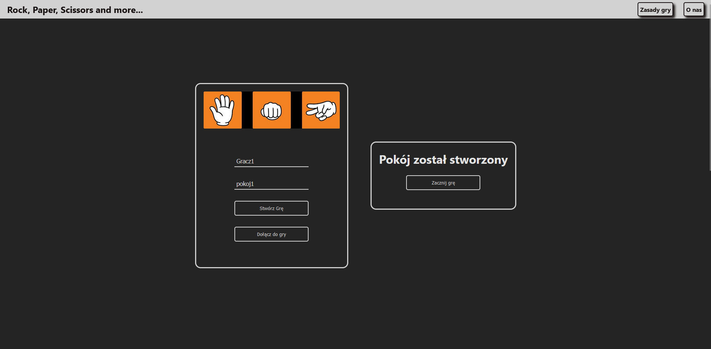
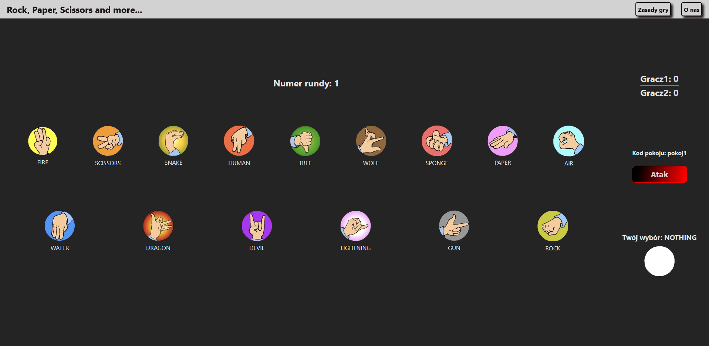
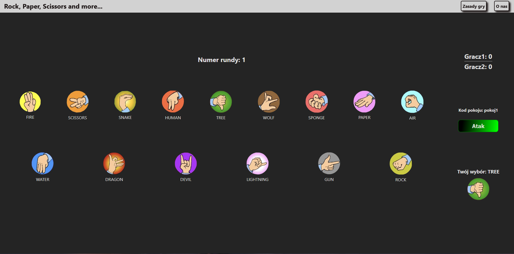
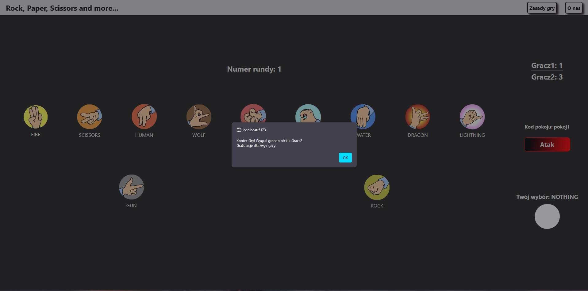
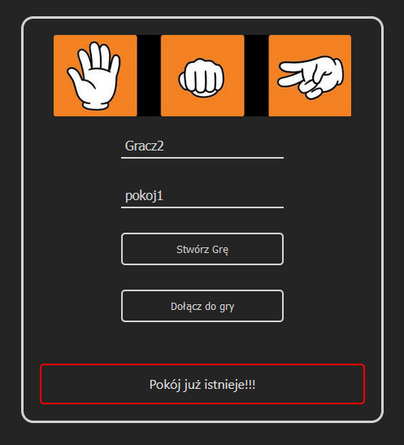
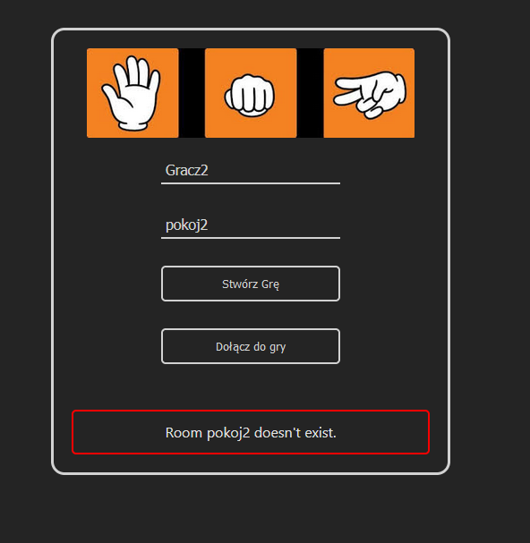

Projekt wykonywany w ramach przedmiotu WWW i języki skryptowe.

## RockPaperScissorsAndMore
Celem projektu było stworzenie przeglądarkowej wersji gry Papier, Kamień, Nożyce w wersji rozszerzonej o dodatkowe ruchy.

### Rozpiska ruchów

### Wstępny Projekt

### Prezentacja wyglądu aplikacji

##### Tworzenie pokoju gry

##### Widok ekranu z trwającą rozgrywką (oczekiwanie na ruch)

##### Widok ekranu z trwającą rozgrywką (wykonywanie ruchu)

##### Wyświetlenie komunikatu z informacją o zwyciężcy

##### Próba stworzenia pokoju o tej samej nazwie co inny pokój

##### Próba dołączenia do nieistniejącego pokoju

### Autorzy:
Frontend: [Grzegorz Bąk](https://github.com/altGreG) 
Backend: [Dorian Sraga](https://github.com/Domicjan)